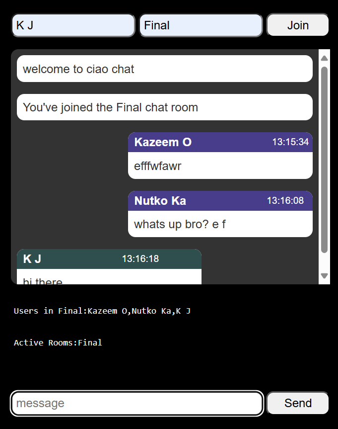

### Chatbot App

This project was built on socket io... with `[Node Engine & expres.js library].`

## Features

The ciao App is a chat platform, where: 
users join a chat room OR create his/her own chat room where friends can join in to discuss.


To learn see usage, check out the `[web preview, documentation]` (https://utzmankazeem.github.io/ciaoChat).

### Code Splitting

App lets users interact, specifying different user with
unique id's. 
the application was created with robust user experience in mind.
users from the same room can see those availble in that room
activity detection is displayed back to each user in proper context of the room e.g `[typing, entry, exit]`

build on Nodejs and expres.js
the app has features like..

generating Username, indicating user actions, user activity etc

```ts
    code uses : Express.js
    functions to : async/await
    proper usage of: import statement
    using version : Node 18.2.0
```

#Nodejs
#Expressjs
#Socket.io
#HTML
#CSS3
#RWD


